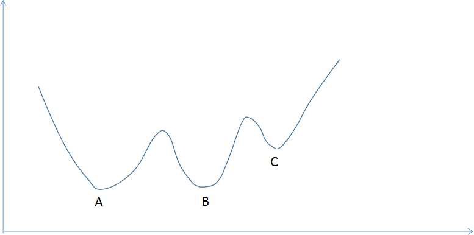
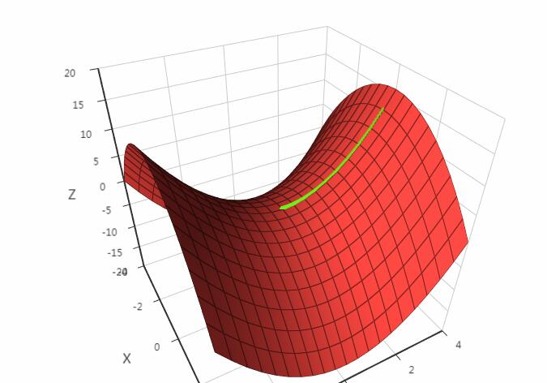
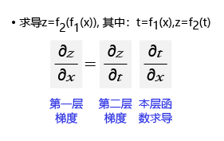
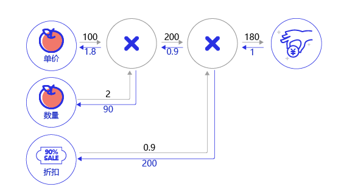
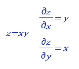
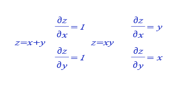
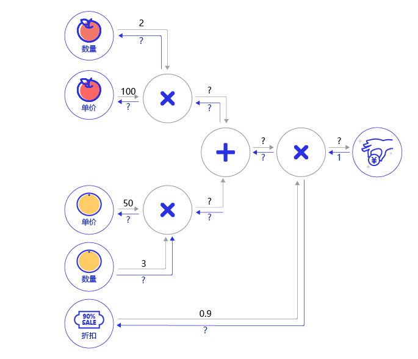
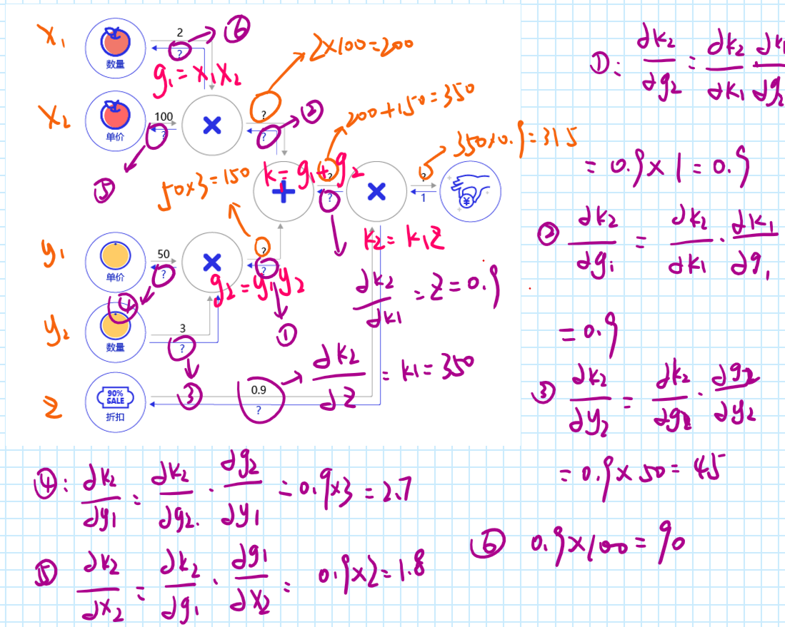
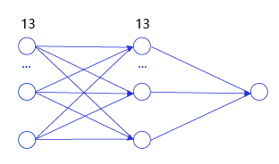

# 8.15作业题目问答

---

## 作业1-2

### 1.样本归一化：预测时的样本数据同样也需要归一化，但使用训练样本的均值和极值计算，这是为什么？

测试的时候我们要尽可能地去符合真实情况，真实世界的样本范围我们拿不到，为了去拟合真实世界。

### 2.当部分参数的梯度计算为0（接近0）时，可能是什么情况？是否意味着完成训练？

这个应该是不一定的，首先它有可能是确实到达了全局的极值点；但是也有可能只是一个局部的极值点，这个时候我们就要去和其他的极值点进行比较，判断哪个是全局的极值点如图片1所示；同样它还有可能根本不是一个极值点，比如说马鞍这样一个特殊的图形，如图片2所示，沿着y轴来看，确实是一个极小值，但是沿着x轴来看却不是极小值，而是一个极大值了。

<center><font size=2 color="Gray">图片1</font></center>


<center><font size=2 color="Gray">图片2</font></center>

---

## 作业1.3

### 1.随机梯度下降的batch_size设置成多少合适？过小有什么问题？过大有什么问题？提示：过大以整个样本集合为例，过小以单个样本为例来思考：

随机梯度下降的batch_size应该根据自身的情况进行设定，如果数据集不是很大，可以将全部数据读入；如果数据太大，可以考虑使用mini_batch。如果设置过小的话，如单个样本，那么每个epoch就会花费较多的时间，同时由于每次都按照一个样本进行更新梯度，那么可能梯度会方向混乱，最后导致无法收敛；如果设置过大的话，如整个样本集合，虽然epoch的时间减少了，但是可能需要更大的epoch,同时对于数据集很大的情况来说，可能会导致内存崩溃。所以要合理地选择batch_size。

### 2.一次训练使用的配置：5个epoch，1000个样本，batch_size=20，最内层循环执行多少轮？

最内层的循环会执行1000/20 = 50轮。

---

## 作业1.4

### 1.求导的链式法则：

链式法则是微积分中的求导法则，用于求一个复合函数的导数，是在微积分的求导运算中一种常用的方法。复合函数的导数将是构成复合这有限个函数在相应点的导数的乘积，就像锁链一样一环套一环，故称链式法则。如图片3所示，如果求最终输出对内层输入（第一层）的梯度，等于外层梯度（第二层）乘以本层函数的梯度。

<center><font size=2 color="Gray">图片3</font></center>

### 2. 计算图的概念:

（1）为何是反向计算梯度？即梯度是由网络后端向前端计算。当前层的梯度要依据处于网络中后一层的梯度来计算，所以只有先算后一层的梯度才能计算本层的梯度。

（2）案例：购买苹果产生消费的计算图。假设一家商店9折促销苹果，每个的单价100元。计算一个顾客总消费的结构如图片4所示。

<center><font size=2 color="Gray">图片4</font></center>

* 前向计算过程：以灰色箭头表示，顾客购买了2个苹果，再加上九折的折扣，一共消费100\*2\*0.9=180元。
* 后向传播过程：以蓝色箭头表示，根据链式法则，本层的梯度计算 * 后一层传递过来的梯度，所以需从后向前计算。

最后一层的输出对自身的求导为1。导数第二层根据图片5所示的乘法求导的公式，分别为0.9\*1和200\*1。同样的，第三层为100\*0.9=90，2\*0.9=1.8。

<center><font size=2 color="Gray">图片5</font></center>

---

## 作业题

### 1.根据图片6所示的乘法和加法的导数公式，完成图片7购买苹果和橘子的梯度传播的题目。


<center><font size=2 color="Gray">图片6</font></center>


<center><font size=2 color="Gray">图片7</font></center>


<center><font size=2 color="Gray">图片7_答案</font></center>

### 2.挑战题：用代码实现两层的神经网络的梯度传播，中间层的尺寸为13【房价预测案例】（教案当前的版本为一层的神经网络），如图片8所示。


<center><font size=2 color="Gray">图片8</font></center>

代码是第一次的，多层代码暂未实现，先占个坑：

```python
import numpy as np
import json
import matplotlib.pyplot as plt

def load_data():
    datafile = 'C:\\vscode\py\python_pigeon_farm\DL\housing.data'
    data = np.fromfile(datafile, sep=' ')
    #print(data)

    feature_names=['CRIM', 'ZN', 'INDUS', 'CHAS', 'NOX', 'RM', 'AGE','DIS', \
                    'RAD', 'TAX', 'PTRATIO', 'B', 'LSTAT', 'MEDV']
    feature_num=len(feature_names)
    data=data.reshape((data.shape[0]//feature_num,feature_num))
    #print(data[0])
    #print(data.shape)

    ratio=0.8
    #offset是训练集的数量
    offset=int(data.shape[0]*ratio)
    train_data=data[:offset]
    #接下来进行数据归一化处理：
    maximums,minimums,avgs=\
        train_data.max(axis=0),\
        train_data.min(axis=0),\
        train_data.sum(axis=0)/train_data.shape[0]
    #对数据进行归一化处理：
    data=(data-avgs)/(maximums-minimums)
    #检查归一化是否成功
    #print(train_data[0])
    train_data=data[:offset]
    test_data=data[offset:]
    return train_data,test_data

class Network(object):
    def __init__(self,num_of_weights):
        #随机产生随机数w，设定同一个种子
        #w表示的是随机产生的参数
        np.random.seed(0)
        self.w=np.random.randn(num_of_weights,1)
        self.b=0

    def forward(self,x):
        z=np.dot(x,self.w)+self.b
        return z

    def loss(self,z,y):
        cost=(z-y)**2
        return np.sum(cost)/cost.shape[0]

    def gradient(self,x,y):
        z=self.forward(x)
        gradient_w=(z-y)*x
        gradient_w=np.mean(gradient_w, axis=0)
        gradient_w=gradient_w[:,np.newaxis]
        gradient_b=(z-y)
        gradient_b=np.mean(gradient_b)
        return gradient_w,gradient_b

    def update(self,gradient_w,gradient_b,eta=0.01):
        self.w-=eta*gradient_w
        self.b-=eta*gradient_b

    def train(self,train_data,num_epoch=100,eta=0.01,batch_size=10):
        n=len(train_data)
        losses=[]
        for epoch_id in range(num_epoch):
            np.random.shuffle(train_data)
            mini_batches=[train_data[k:k+batch_size] for k in range(0,n,batch_size)]
            for mini_batch in mini_batches:
                test_x=mini_batch[:,:-1]
                test_y=mini_batch[:,-1:]
                losses.append(self.loss(self.forward(test_x),test_y))
                gradient_w,gradient_b=self.gradient(test_x,test_y)
                self.update(gradient_w,gradient_b,eta)
        return losses,self.w,self.b

train_data,test_data=load_data()
net=Network(train_data[:,:-1].shape[1])
#forward=net.forward(x)
#loss=net.loss(forward(x),y)
#下面是计算显示损失函数：
#print(net.loss(z,y)[0])
#下面是同时计算404个数据使用：
#print(net.forward(x))
#gradient_w,gradient_b=net.gradient(x,y)
#print(gradient_w[0],gradient_b[0])
num_iterations=20
num_batch_size=10
eta=0.01
losses,w,b=net.train(train_data,num_epoch=num_iterations,eta=0.01,batch_size=num_batch_size)

plot_x=np.arange(len(losses))
plot_y=np.array(losses)
plt.plot(plot_x,plot_y)
plt.savefig('C:\\vscode\py\python_pigeon_farm\DL\loss_stochastic.png')
plt.show()
print(w,b)
```